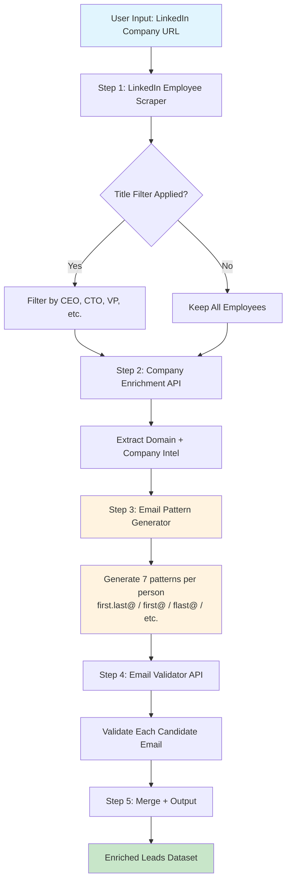
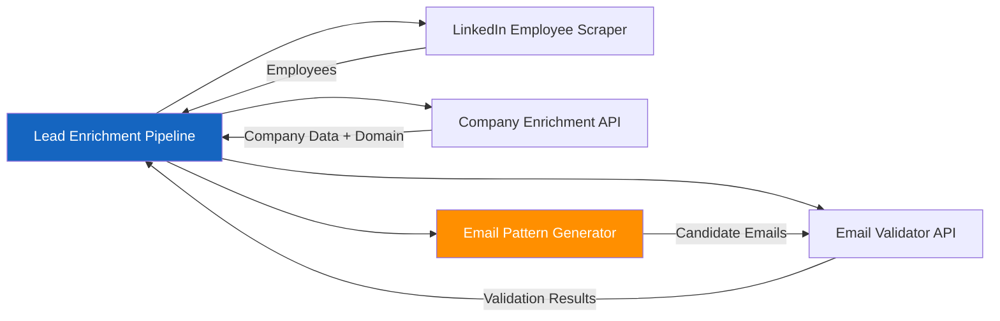

# Lead Enrichment Pipeline

One API call to turn a LinkedIn company URL into verified employee contacts with emails. No manual research, no tab switching, no copy pasting.

## 简介

一个API调用：输入公司LinkedIn链接，获取员工资料、验证的电子邮件和公司数据。每条线索$0.03。替代Apollo（$99/月）。

## What It Does

You provide a LinkedIn company URL. The pipeline does the rest:

1. **Scrapes employees** from the company LinkedIn page (names, titles, profile URLs)
2. **Enriches the company** (industry, tech stack, domain, social profiles)
3. **Generates candidate emails** using 7 common corporate email patterns per person
4. **Validates every email** to confirm deliverability before you send

You get back a clean JSON array of enriched leads ready for outreach.

## How It Works



## Quick Start

### On Apify Console

1. Open the actor on Apify Store
2. Set the **Company LinkedIn URL** (e.g., `https://www.linkedin.com/company/stripe`)
3. Optionally set the **Company Website** for better enrichment
4. Optionally filter by **Title Keywords** like `CEO, CTO, VP, Director`
5. Click **Start** and wait for results

### Via API

```bash
curl -X POST "https://api.apify.com/v2/acts/george.the.developer~lead-enrichment-pipeline/runs?token=YOUR_TOKEN" \
  -H "Content-Type: application/json" \
  -d '{
    "companyUrl": "https://www.linkedin.com/company/stripe",
    "companyWebsite": "https://stripe.com",
    "maxEmployees": 10,
    "filterTitles": ["CEO", "CTO", "VP", "Director"],
    "validateEmails": true
  }'
```

### Via Apify Client (Node.js)

```javascript
import { ApifyClient } from 'apify-client';

const client = new ApifyClient({ token: 'YOUR_TOKEN' });

const run = await client.actor('george.the.developer/lead-enrichment-pipeline').call({
    companyUrl: 'https://www.linkedin.com/company/stripe',
    companyWebsite: 'https://stripe.com',
    maxEmployees: 10,
    filterTitles: ['CEO', 'CTO', 'VP'],
    validateEmails: true,
});

const { items } = await client.dataset(run.defaultDatasetId).listItems();
console.log(items);
```

## Output Format

Each lead in the dataset looks like this:

```json
{
    "fullName": "Patrick Collison",
    "firstName": "Patrick",
    "lastName": "Collison",
    "title": "CEO and Co-founder at Stripe",
    "linkedinUrl": "https://www.linkedin.com/in/patrickcollison/",
    "company": {
        "name": "Stripe",
        "domain": "stripe.com",
        "industry": "Financial Services",
        "description": "Financial infrastructure for the internet",
        "technologies": ["React", "Node.js", "Ruby"],
        "socialProfiles": {
            "linkedin": "https://www.linkedin.com/company/stripe",
            "twitter": "https://twitter.com/stripe"
        }
    },
    "emails": [
        {
            "email": "patrick@stripe.com",
            "valid": true,
            "score": 0.9
        },
        {
            "email": "patrick.collison@stripe.com",
            "valid": true,
            "score": 0.85
        },
        {
            "email": "pcollison@stripe.com",
            "valid": false,
            "score": 0.2
        }
    ],
    "enrichedAt": "2026-04-08T12:00:00.000Z"
}
```

## Email Pattern Generation

The pipeline generates 7 common corporate email patterns for each employee:

| Pattern | Example |
|---------|---------|
| first.last@domain | patrick.collison@stripe.com |
| first@domain | patrick@stripe.com |
| flast@domain | pcollison@stripe.com |
| firstl@domain | patrickc@stripe.com |
| last.first@domain | collison.patrick@stripe.com |
| first_last@domain | patrick_collison@stripe.com |
| last@domain | collison@stripe.com |

Each pattern is then validated against the mail server to confirm deliverability.

## Input Parameters

| Parameter | Type | Required | Default | Description |
|-----------|------|----------|---------|-------------|
| companyUrl | string | Yes | | LinkedIn company page URL |
| companyWebsite | string | No | | Company website for enrichment |
| maxEmployees | integer | No | 10 | Max employees to extract (1 to 50) |
| filterTitles | string[] | No | [] | Only include matching title keywords |
| validateEmails | boolean | No | true | Validate discovered emails |
| apifyToken | string | No | | Your Apify token for sub actor calls |

## Pricing

**$0.03 per enriched lead** via Pay Per Event.

This includes LinkedIn scraping, company enrichment, email generation, and email validation all in one call.

### Comparison with alternatives

| Service | Cost per lead | What you get |
|---------|--------------|--------------|
| **This pipeline** | **$0.03** | LinkedIn profile + company intel + validated emails |
| Apollo.io | $0.10 to $0.50 | Similar data, monthly subscription required |
| Hunter.io | $0.05 to $0.15 | Email only, no LinkedIn scraping |
| Clearbit | $0.20 to $1.00 | Company enrichment only |
| Manual research | $2 to $5/hr | Time intensive, error prone |

## Architecture

The pipeline orchestrates three existing Apify actors:



The email pattern generator is the core value. LinkedIn gives names but not emails. Company enrichment gives generic contact emails. The pattern generator bridges the gap by creating personalized candidate emails from names and the company domain, then validates each one.

## Use Cases

- **Sales prospecting**: Find decision makers at target companies with verified emails
- **Recruiting**: Build candidate lists with contact information
- **Market research**: Map out team structures at competitor companies
- **Partnership outreach**: Find the right people to contact at potential partner companies
- **Investor research**: Identify key executives at portfolio companies

## Tips for Best Results

- Always provide the **company website** when you know it. This improves enrichment accuracy.
- Use **title filters** to focus on decision makers and reduce costs.
- Set **maxEmployees** to a reasonable number. Start with 10 and increase if needed.
- The pipeline works best for companies with active LinkedIn presence.

## Limitations

- LinkedIn scraping depends on publicly available profile data
- Email validation accuracy depends on the target mail server configuration
- Some mail servers block SMTP checks, resulting in lower confidence scores
- Rate limits apply to sub actor calls
